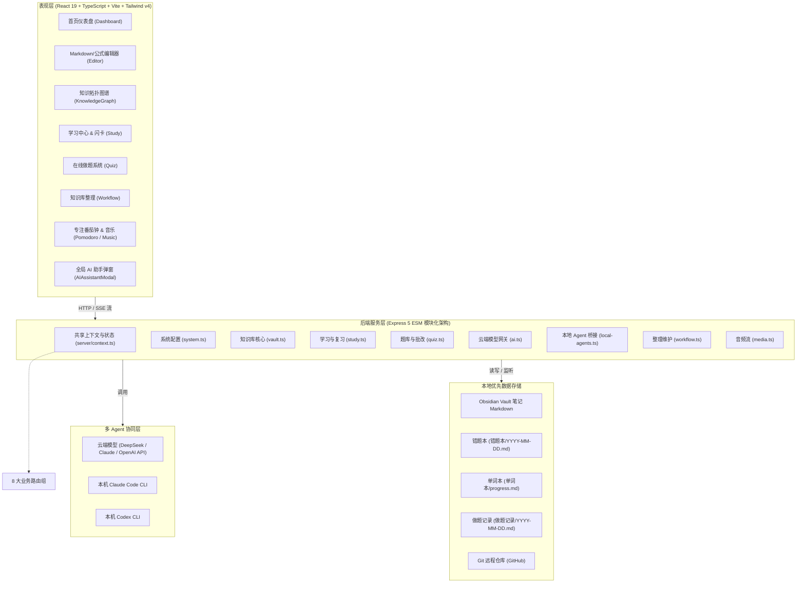

# Knowledge Viz · 项目全景架构与维护指南

> **定位**：面向 **考研 408 计算机综合** 与 **考研数学（数一/数二/数三）** 的一体化本地知识管理、智能刷题与多 Agent 协同学习工作台。
>
> **核心原则**：本地优先（Local-First）、无厂商锁定（基于本地 Obsidian Vault 与 Markdown）、双学科深度融合、多 Agent（云端 AI + 本地 Claude Code / Codex）辅助学习。

---

## 目录索引

- [一、 学科体系与业务定位](#一-学科体系与业务定位)
- [二、 系统分层架构](#二-系统分层架构)
- [三、 前后端架构简述 (速览)](#三-前后端架构简述-速览)
- [四、 优化后的代码目录与维护字典](#四-优化后的代码目录与维护字典)
- [五、 考研数学与 LaTeX 公式规范](#五-考研数学与-latex-公式规范)
- [六、 核心业务数据流与时序](#六-核心业务数据流与时序)
- [七、 开发运维与 GitHub 同步指南](#七-开发运维与-github-同步指南)

---

## 一、 学科体系与业务定位

本项目服务于工科与计算机考研最核心的两大科目，提供知识梳理、公式定理记忆、真题刷题、错题诊断及 AI 启发式答疑的全闭环体验：

```
                           Knowledge Viz 学习中枢
                 ┌───────────────────┴───────────────────┐
                 ▼                                       ▼
       【408 计算机学科专业基础综合】                 【全国硕士研究生考研数学】
       ├─ 数据结构 (DS)                              ├─ 高等数学 / 微积分 (高数)
       ├─ 计算机组成原理 (CO)                        ├─ 线性代数 (线代)
       ├─ 操作系统 (OS)                              └─ 概率论与数理统计 (概率)
       └─ 计算机网络 (CN)                                 (覆盖：数一 / 数二 / 数三)
                 │                                       │
                 └───────────────────┬───────────────────┘
                                     ▼
                      ┌─────────────────────────────┐
                      │ 统一能力底座与学习辅助工具  │
                      ├─────────────────────────────┤
                      │ 📝 沉浸式知识编辑 (KaTeX公式)│
                      │ 🧠 智能复习 (SM-2 算法闪卡) │
                      │ 📋 分科智能题库 (选择/填空) │
                      │ 🎯 多维错题本 (定位知识笔记)│
                      │ 🤖 考研专属 AI 导师/Agent   │
                      │ 🎵 专注番茄钟与环境声白噪音 │
                      └─────────────────────────────┘
```

---

## 二、 系统分层架构



---

## 三、 前后端架构简述 (速览)

### 3.1 前端架构简述 (Frontend)

- **核心设计**：单页应用（SPA），基于 **React 19 + TypeScript + Vite 8**，采用温暖克制的苹果风微质感 UI（Tailwind CSS v4）。
- **页面体系 (11 大功能页面)**：
  1. **首页 (`/dashboard`)**：Vault 健康评分、笔记字数与数量统计、最近编辑动态、下一步学习推荐。
  2. **编辑器 (`/editor`)**：Markdown 源码/分栏/预览、大纲树状目录、字符统计与阅读时长、AI 辅助写作。
  3. **知识图谱 (`/graph`)**：基于 `@xyflow/react` 与 D3 渲染的知识网络拓扑，支持孤立笔记与断链高亮。
  4. **做题中心 (`/quiz`)**：408 与 考研数学真题专项练习、倒计时模拟考、分科答题卡与智能批改。
  5. **学习中心 (`/study`)**：基于 SM-2 艾宾浩斯间隔记忆算法的知识闪卡翻转复习与每日复习清单。
  6. **错题本 (`/study` 内错题)**：自动收录练习错题，记录作答、正确推导及错因标签，双链跳转笔记。
  7. **背单词 (`/vocabulary`)**：考研英语大纲高频词汇记忆卡、词根词缀衍生关系拓扑。
  8. **知识整理 (`/workflow`)**：Vault Lint 格式修复、标签合并重构、重复笔记检测与 Fold 结构重组。
  9. **番茄钟 (`/pomodoro`)**：备考专注计时器、阶段休息提醒与自习统计。
  10. **专注音乐 (`/music`)**：精选 Lofi/古典网络电台、白噪音环境声混音、本地音乐流式播放。
  11. **设置 (`/settings`)**：Vault 目录绑定、AI API 密钥与模型参数、本地 Agent 执行路径配置。
- **全局浮层与通信组件**：
  - **`Layout.tsx`**：主导航布局、Ctrl+K 搜索唤起、知识库连接状态探测。
  - **`AIAssistantModal.tsx`**：全局随时唤起的 AI 助手弹窗（支持网页 AI、Claude Code、Codex 模式无缝切换）。
  - **`AudioContext.tsx` & `MiniPlayer.tsx`**：全站持久化的全局底部音乐流悬浮播放器。
- **通信与状态持久化**：
  - `src/services/api.ts`：封装了所有面向后端的 HTTP 接口调用与 SSE 实时流监听。
  - `src/services/ai-workspace.ts`：将 AI 项目、会话历史与启用 Skill 状态本地持久化在浏览器 LocalStorage 中。

### 3.2 后端架构简述 (Backend)

- **核心设计**：**微内核 + 模块化路由架构**（Express 5 ESM），经重构已将 3,346 行单体拆分至独立路由文件，启动入口仅 105 行，并通过 `esbuild` 在 8ms 内极速打包。
- **核心中间件与上下文 (`server/context.ts`)**：
  - 统一配置加载 (`config.json`) 与持久化。
  - 多厂商 AI Client 适配管理（支持 Anthropic、DeepSeek、OpenAI 兼容协议）。
  - 本地 Vault 笔记内存缓存（TTL 10 秒失效）与全量目录树扫描。
  - 跨客户端 SSE 事件广播中心与 `selfWriteTracker` 防自写回环机制。
- **8 大模块化业务路由 (`server/routes/`)**：
  | 路由模块 | 职责范围 | 挂载 API 前缀 |
  | :--- | :--- | :--- |
  | **`system.ts`** | 系统健康探活、运行路径设置、本地文件目录浏览、Obsidian 插件 AI 配置一键识别导入 | `/api/health`, `/api/settings`, `/api/fs/*`, `/api/obsidian/*` |
  | **`vault.ts`** | Vault 笔记增删改查、树状结构、全文检索、D3 拓扑数据生成、MarkItDown 文档转换导入 | `/api/vault/*`, `/api/ingest/*` |
  | **`study.ts`** | 笔记知识点 AI 闪卡提取、每日复习队列、多学科错题本管理、考研大纲英语词汇库 | `/api/study/*`, `/api/vocab/*` |
  | **`quiz.ts`** | 408 与数学做题提交打分、批改总结存入 Vault、AI 自动出题、历史考试记录 | `/api/quiz/*` |
  | **`ai.ts`** | 网页端知识库 RAG 问答、Agent Tool Use 循环、思维导图 Canvas 生成、网页文章抓取转笔记 | `/api/chat`, `/api/agent/chat`, `/api/think`, `/api/defuddle`, ... |
  | **`local-agents.ts`** | 本机 Claude Code CLI 与 Codex CLI 进程生成、上下文拼装与 SSE 流式输出桥接 | `/api/local-agents/*` |
  | **`workflow.ts`** | 知识库 Lint 结构修复、标签批量重命名/合并、重复笔记合并、Fold 结构重构、后台定时巡检 | `/api/fold/*`, `/api/vault/tags/*`, `/api/vault/duplicates/*`, `/api/schedule/*` |
  | **`media.ts`** | 本地音乐音频格式扫描、HTTP 206 Partial Content 分块音频流式播放 | `/api/music/*` |
- **本地文件监听与自动化底座**：
  - `chokidar` 实时监听用户本地 Obsidian Vault 的文件变动，通过 SSE 实时推送到前端页面刷新。
  - `VaultScheduler` 支持基于定时规则自动执行笔记结构整理与健康检查。

---

## 四、 优化后的代码目录与维护字典

本项目采用前后端一体但严格解耦的工程结构，已完成从 3346 行单体后端向模块化路由的彻底重构。

### 1. 核心目录全景

```text
obsidian-viz/
├─ 项目.md                     <-- 本说明文档 (纳入 Git 跟踪)
├─ package.json                <-- 项目依赖与启动脚本
├─ vite.config.ts              <-- 前端构建配置
├─ index.html                  <-- 前端 HTML 挂载入口
├─ electron/                   <-- Electron 桌面端主进程
│  ├─ main.cjs                 <-- Electron 主窗口与生命周期
│  └─ preload.cjs              <-- 预加载安全通道
├─ server/                     <-- 后端服务 (Express 5 ESM)
│  ├─ index.ts                 <-- 服务入口 (轻量挂载路由，~105 行)
│  ├─ context.ts               <-- 共享上下文 (配置、Vault缓存、SSE事件广播、防回环写入)
│  ├─ routes/                  <-- 模块化路由控制器
│  │  ├─ system.ts             <-- 探活、路径设置、Obsidian 插件 AI 密钥导入
│  │  ├─ vault.ts              <-- 笔记增删改查、树形图、搜索、文件导入
│  │  ├─ study.ts              <-- 闪卡、每日复习、错题本 (408+数学)、背单词
│  │  ├─ quiz.ts               <-- 在线测试提交、AI 自动出题、历史做题成绩
│  │  ├─ ai.ts                 <-- 智能对话、思维导图、网页内容提取、知识探索
│  │  ├─ local-agents.ts       <-- Claude Code / Codex CLI 本机进程桥接
│  │  ├─ workflow.ts           <-- Vault Lint 结构修复、标签重构、重复笔记合并、定时任务
│  │  └─ media.ts              <-- 本地音乐扫描、流式播放、电台配置
│  ├─ vault-parser.ts          <-- Markdown 正文与 Frontmatter 高速解析
│  ├─ graph-builder.ts         <-- 知识图谱拓扑构建
│  ├─ health-checker.ts        <-- 知识库健康度评估与孤立节点检测
│  ├─ agent.ts                 <-- 网页端 AI 对话与 Tool Use 循环
│  ├─ ai-client.ts             <-- Anthropic 与 OpenAI 兼容协议适配器
│  └─ local-agent-bridge.ts    <-- 本地 Agent 子进程管理与 SSE 流封装
├─ src/                        <-- 前端表现层 (React 19 + TypeScript)
│  ├─ App.tsx                  <-- 前端根组件与路由映射
│  ├─ main.tsx                 <-- React DOM 挂载入口
│  ├─ index.css                <-- 全局样式与 Tailwind 指令
│  ├─ types/
│  │  └─ subject.ts            <-- 408 与考研数学多学科统一数据类型模型
│  ├─ components/              <-- 可复用 UI 与业务组件
│  │  ├─ Layout.tsx            <-- 顶部导航、快捷键监听、Vault 状态
│  │  ├─ AIAssistantModal.tsx  <-- 全局唤起的 AI 工作台弹窗
│  │  ├─ ChatMessage.tsx       <-- 对话气泡与 Markdown 渲染
│  │  ├─ SearchModal.tsx       <-- Ctrl+K 全局快速搜索
│  │  ├─ music/                <-- 迷你播放器与悬浮控件
│  │  ├─ quiz/                 <-- 答题卡、计时器、做题结果解析卡片
│  │  ├─ study/                <-- 闪卡翻转卡片、记忆复习队列
│  │  └─ workflow/             <-- 整理建议对比卡片、标签重构树
│  ├─ pages/                   <-- 11 大核心功能页面
│  │  ├─ Dashboard.tsx         <-- 首页 (Vault健康度、最近修改、下一步学习)
│  │  ├─ Editor.tsx            <-- 沉浸式笔记编辑 (预览/分栏/大纲)
│  │  ├─ KnowledgeGraph.tsx    <-- D3 / xyflow 知识网络拓扑
│  │  ├─ Study.tsx             <-- 学习复习中心与艾宾浩斯记忆库
│  │  ├─ Quiz.tsx              <-- 408 + 考研数学在线做题与专项练习
│  │  ├─ Vocabulary.tsx        <-- 考研英语大纲词汇高效刷词
│  │  ├─ Workflow.tsx          <-- 知识库自动化整理 (Lint、Fold、去重)
│  │  ├─ Pomodoro.tsx          <-- 考研专注番茄钟
│  │  ├─ Music.tsx             <-- 专注自习背景音与电台
│  │  ├─ Chat.tsx              <-- 独立 AI 导师全屏对话
│  │  └─ Settings.tsx          <-- 知识库路径、AI 模型参数、本地 Agent 设置
│  ├─ data/                    <-- 静态数据与内置题库
│  │  ├─ questions/
│  │  │  ├─ index.ts           <-- 408 题库汇聚入口
│  │  │  ├─ data-structures.ts <-- 数据结构经典真题
│  │  │  ├─ computer-organization.ts <-- 计算机组成原理真题
│  │  │  ├─ operating-systems.ts     <-- 操作系统真题
│  │  │  ├─ computer-networks.ts     <-- 计算机网络真题
│  │  │  └─ math/              <-- 考研数学专项题库
│  │  │     ├─ index.ts        <-- 数学题库汇聚与抽取函数
│  │  │     ├─ calculus.ts     <-- 高等数学精选试题 (极限、积分、微分方程)
│  │  │     ├─ linear-algebra.ts<-- 线性代数精选试题 (特征值、矩阵、二次型)
│  │  │     └─ probability.ts  <-- 概率论与数理统计试题 (分布、数字特征)
│  │  └─ ai-skills.ts          <-- 内置 AI 技能预设 (解题、出题、改写)
│  ├─ services/
│  │  ├─ api.ts                <-- 后端所有 RESTful / SSE 接口的封装
│  │  └─ ai-workspace.ts       <-- AI 对话会话与项目在 LocalStorage 的持久化
│  └─ contexts/                <-- 全局状态上下文 (音频播放等)
└─ docs/                       <-- 长期产品与实施文档
   ├─ PRODUCT-VISION.md        <-- 产品愿景与长期路线图
   └─ IMPLEMENTATION-PLAN-100-USERS.md <-- 多设备云同步实施规划
```

### 2. 开发者“改什么找哪个文件”维护字典

| 当您想要修改或增加... | 应该前往的代码路径 |
| :--- | :--- |
| **新增 408 试题** | [`src/data/questions/`](file:///e:/知识库项目/obsidian-viz/src/data/questions/) (按四门科目文件追加题目) |
| **新增考研数学试题 (高数/线代/概率)** | [`src/data/questions/math/`](file:///e:/知识库项目/obsidian-viz/src/data/questions/math/) (支持 LaTeX 格式编写) |
| **扩展学科类型或题目字段** | [`src/types/subject.ts`](file:///e:/知识库项目/obsidian-viz/src/types/subject.ts) |
| **调整做题界面与评分机制** | [`src/pages/Quiz.tsx`](file:///e:/知识库项目/obsidian-viz/src/pages/Quiz.tsx) 与 [`server/routes/quiz.ts`](file:///e:/知识库项目/obsidian-viz/server/routes/quiz.ts) |
| **调整错题本记录与复习逻辑** | [`server/routes/study.ts`](file:///e:/知识库项目/obsidian-viz/server/routes/study.ts) 与 [`src/pages/Study.tsx`](file:///e:/知识库项目/obsidian-viz/src/pages/Study.tsx) |
| **调整 AI 导师提示词 / 增加新 Skill** | [`src/data/ai-skills.ts`](file:///e:/知识库项目/obsidian-viz/src/data/ai-skills.ts) 与 [`server/routes/ai.ts`](file:///e:/知识库项目/obsidian-viz/server/routes/ai.ts) |
| **修改本地 Claude Code / Codex 逻辑** | [`server/routes/local-agents.ts`](file:///e:/知识库项目/obsidian-viz/server/routes/local-agents.ts) 与 [`server/local-agent-bridge.ts`](file:///e:/知识库项目/obsidian-viz/server/local-agent-bridge.ts) |
| **修改知识库文件读写与缓存机制** | [`server/vault-parser.ts`](file:///e:/知识库项目/obsidian-viz/server/vault-parser.ts) 与 [`server/context.ts`](file:///e:/知识库项目/obsidian-viz/server/context.ts) |
| **修改顶部导航栏与快捷键** | [`src/components/Layout.tsx`](file:///e:/知识库项目/obsidian-viz/src/components/Layout.tsx) |
| **修改系统设置与端口/代理配置** | [`server/routes/system.ts`](file:///e:/知识库项目/obsidian-viz/server/routes/system.ts) 与 [`src/pages/Settings.tsx`](file:///e:/知识库项目/obsidian-viz/src/pages/Settings.tsx) |

---

## 五、 考研数学与 LaTeX 公式规范

为保证考研数学在题库、笔记、解析和 AI 对话中的高质量渲染，所有公式均遵循 LaTeX / KaTeX 标准：

### 1. 书写语法规范
- **行内公式**：使用单个美元符号包裹，前后尽量加空格以便解析。
  - *范例*：`若随机变量 $X \sim N(0, 1)$，则方差为 $D(X) = 1$。`
- **块级公式**：使用双美元符号包裹，单独成行。
  - *范例*：
    ```latex
    $$
    \lim_{x \to 0} \frac{x - \sin x}{x^3} = \frac{1}{6}
    $$
    ```
- **矩阵排版**：
  ```latex
  $$
  A = \begin{pmatrix}
  a_{11} & a_{12} \\
  a_{21} & a_{22}
  \end{pmatrix}
  $$
  ```
- **分段函数**：
  ```latex
  $$
  f(x) = \begin{cases}
  \frac{\sin x}{x}, & x \neq 0 \\
  1, & x = 0
  \end{cases}
  $$
  ```

### 2. 统一题目数据契约 (`UnifiedQuestion`)
所有数学及 408 题目均统一在 [`src/types/subject.ts`](file:///e:/知识库项目/obsidian-viz/src/types/subject.ts) 中定义：
- `domain`: `'cs_408'` | `'math'`
- `subject`: `'高等数学'` | `'线性代数'` | `'概率论与数理统计'` | `'数据结构'` | ...
- `scope`: `['数一', '数二', '数三']`（仅数学适用）
- `type`: `'choice'`（单选）| `'blank'`（填空）| `'analysis'`（大题推导）
- `steps`: 分步演算推导（数学解答题与错题分析的核心依据）
- `keyPoints`: 考点与定理索引（如 `['中值定理', '辅助函数']`）

---

## 六、 核心业务数据流与时序

### 1. 做题与错题归因流
```
[用户在页面做题 (Quiz.tsx)]
       │
       ▼
[POST /api/quiz/submit 提交作答]
       │
       ├─ 计算正确率与分科统计
       ├─ 生成评测报告 Markdown
       └─ 保存到 Vault/做题记录/YYYY-MM-DD-HHmm.md (建立永久档案)
       │
       ▼ (若产生错题)
[POST /api/study/error-log]
       │
       ├─ 追加到 Vault/错题本/YYYY-MM-DD.md
       ├─ 记录题干、用户答案、正确推导、错因分类 (概念/公式/计算)
       └─ 依据艾宾浩斯算法设定 nextReview 下次复习日期
```

### 2. 双通道 AI 调用流
```
                 [用户在 AI 工作台输入提问]
                            │
               ┌────────────┴────────────┐
               ▼                         ▼
      【模式 A: 网页/云端 AI】     【模式 B: 本地 Agent CLI】
      POST /api/agent/chat       POST /api/local-agents/chat
               │                         │
      [知识库相似笔记检索注入]     [以 Vault/工作目录作为 Cwd]
               │                         │
      [调用 DeepSeek/Claude]     [调用本机 claude / codex 子进程]
               │                         │
               └────────────┬────────────┘
                            ▼
                  [Server-Sent Events (SSE) 流式推送到前端展示]
```

---

## 七、 开发运维与 GitHub 同步指南

### 1. 本地常用开发命令

```bash
# 1. 启动前端 Vite 开发服务器 (端口 5173)
npm run dev

# 2. 启动后端 Express 开发服务器 (热重载，端口 3001)
npm run server:dev

# 3. 同时启动前端与后端 (推荐日常开发使用)
npm run dev:all

# 4. 启动包含前端、后端和 Electron 桌面的完整环境
npm run electron:dev

# 5. 构建全量代码 (前端构建 + 后端 esbuild 打包)
npm run build:all

# 6. 打包生成 Windows 独立安装包 (NSIS Setup.exe)
npm run pack
```

### 2. 本地配置文件说明
- 配置文件为 [`server/config.json`](file:///e:/知识库项目/obsidian-viz/server/config.json)，**已被 `.gitignore` 保护，严禁提交到公共仓库**。
- 格式参考 `server/config.example.json`，支持自定义 `vaultPath`、`proxy`、`ai` 密钥与 `localAgents` 执行路径。

### 3. 与 GitHub 同步的标准工作流

当您完成了代码修改或试题扩展，按以下步骤同步到 GitHub：

```bash
# 1. 进入仓库根目录
cd /d "e:\知识库项目\obsidian-viz"

# 2. 先做构建验证，保证没有类型错误与打包错误
npm run build:all

# 3. 查看当前变动状态
git status

# 4. 将改动文件加入暂存区
git add .

# 5. 撰写清晰的提交说明
git commit -m "feat: 升级为408与考研数学双核心架构并重构服务端路由"

# 6. 推送至 GitHub 远程 main 分支
git push origin main
```

---

*知识是一座需要不断整理与复习的花园。祝 408 与考研数学复习圆满上岸！*
